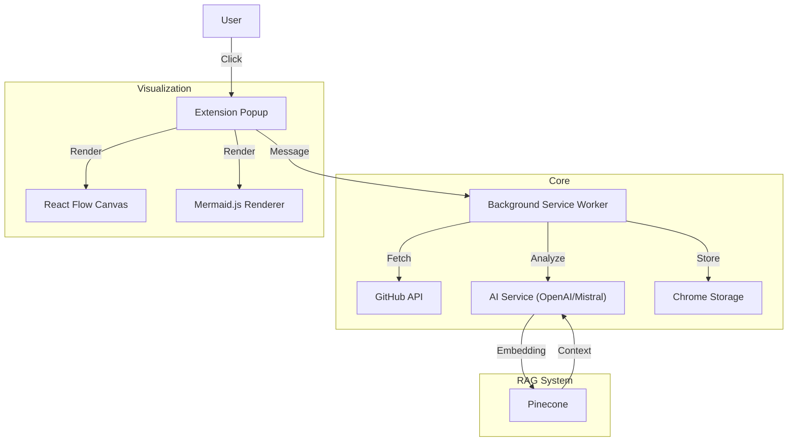

# Architecture

## AI Service - OpenAI & Mistral

## Key Modules

| Module | Purpose |
| :--- | :--- |
| **Content Script** | Injects UI overlay into GitHub DOM. |
| **Background** | Handles API calls, Storage, and AI processing off-main-thread. |
| **Popup** | The main React application where diagrams are rendered. |
| **Parser** | Converts raw file trees into graph structures (`structureParser.ts`). |
