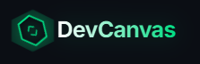

<div align="center">
  
  
  <h1>DevCanvas</h1>
  
  <p><strong>Visualize. Document. Master.</strong></p>
  <p>The ultimate browser extension for engineering teams to turn GitHub repositories into visual intelligence instantly.</p>

  <p>
    <a href="https://github.com/roshankumar0036singh/DevCanvas/releases/latest">
      
    </a>
    <a href="https://github.com/roshankumar0036singh/DevCanvas/issues">
      
    </a>
    <a href="https://github.com/roshankumar0036singh/DevCanvas/pulls">
      
    </a>
    <a href="https://github.com/roshankumar0036singh/DevCanvas/stargazers">
      
    </a>
    <a href="./LICENSE">
      
    </a>
  </p>

  <p>
    
    
    
    
  </p>
</div>

---

## 🚀 Overview

**DevCanvas** transforms your GitHub experience by replacing static file lists with dynamic visual maps. Leveraging **advanced AI**, it generates architectural diagrams, health audits, and sequence flows directly within your browser, giving you immediate insight into complex codebases.

Whether you're debugging a PR, onboarding new team members, or documenting legacy code, DevCanvas provides the visual context you need in seconds.

---

## ✨ Key Features

<div align="center">

| 🔍 **Visual Analysis** | 🛡️ **Smart Audits** | 📦 **Deep Context** |
| :--- | :--- | :--- |
| **Instant Diagrams**: Generate Flowcharts, Sequence Diagrams, and Class Maps from any repo. | **Health Checks**: Identify code smells, circular dependencies, and security risks visually. | **File Structure**: Navigate large monorepos with an interactive, categorized file tree. |
| **AI-Powered**: Understand "What does this file do?" with one-click AI summaries. | **PR Reviews**: Visualize changes in Pull Requests to catch architectural drift. | **Premium Docs**: Export diagrams and documentation to Markdown, PDF, or PNG. |

</div>

## � Installation

1. **Clone the Repository**
   ```bash
   git clone https://github.com/roshankumar0036singh/DevCanvas.git
   cd DevCanvas
   ```

2. **Install Dependencies**
   ```bash
   npm install
   ```

3. **Build Extension**
   ```bash
   npm run build:dev
   ```

4. **Load in Chrome**
   - Open `chrome://extensions/`
   - Enable **Developer mode** (top right)
   - Click **Load unpacked**
   - Select the `dist` folder in the project directory.

## �️ Usage

1. Navigate to any GitHub repository.
2. Click the **DevCanvas** icon in the browser toolbar (or open the side panel).
3. Choose an analysis mode:
   - **Flowchart**: Visualize repository structure.
   - **Health Map**: Audit code quality.
   - **Issues**: Analyze open issues with AI.
   - **README**: Generate or enhance documentation.

## 🤝 Contributing

We welcome contributions! Please see our [CONTRIBUTING.md](./CONTRIBUTING.md) for details on how to get started.

## 📄 License

Distributed under the MIT License. See `LICENSE` for more information.

<div align="center">
  <sub>Built with ❤️ by the DevCanvas Team</sub>
</div>
