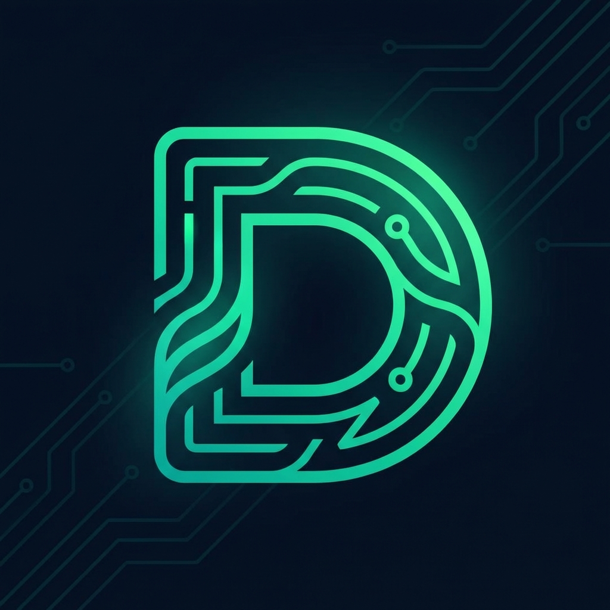

<div align="center">
  
  <h1>DevCanvas</h1>
  <p><strong>Professional visual documentation and collaboration browser extension for engineers.</strong></p>

  <p>
    
    
    
    
  </p>
</div>

---

## 🌟 Overview

**DevCanvas** is a cutting-edge browser extension designed to turn your code into visual intelligence. Whether you're an engineering student or a senior architect, DevCanvas helps you document, visualize, and audit your code directly from your browser.

- **Diagram-as-Code**: Generate flowcharts, sequence diagrams, and class diagrams instantly using Mermaid.js and PlantUML.
- **AI-Driven PR Reviews**: Get executive-level technical audits of your pull requests with actionable resolutions and security insights.
- **Markdown Workspace**: A professional documentation environment with live previews and integrated diagram embedding.
- **Cyber-Hex Branding**: A modern, innovative UI designed for a premium developer experience.

## 🛠️ Key Features

- 💎 **Cyber-Hex UI**: A state-of-the-art interface with glassmorphism and neon-glow aesthetics.
- ⚡ **Lightning Fast Diagrams**: Create complex system architectures from natural language or code diffs.
- 🛡️ **Security-First Audits**: Automated detection of vulnerabilities and performance bottlenecks in your Git diffs.
- 🧩 **Extension Native**: Seamlessly integrated into Chrome and Edge as a side-panel or popup tool.

## 🚀 Getting Started

### Prerequisites

- **Node.js**: 18.x or higher
- **Browser**: Google Chrome, Microsoft Edge, or any Chromium-based browser.

### Installation

1. **Clone the Repo**
   ```bash
   git clone https://github.com/devcanvas/devcanvas.git
   cd devcanvas
   ```

2. **Install Dependencies**
   ```bash
   npm install
   ```

3. **Development Build**
   ```bash
   npm run build:dev
   ```

4. **Load in Browser**
   - Open `chrome://extensions/`
   - Enable **Developer mode**.
   - Click **Load unpacked** and select the `dist` folder.

## 📖 Development Workflow

- `npm run dev`: Build and watch for changes.
- `npm run build`: Production-ready build.
- `npm run lint`: Run ESLint to ensure code quality.
- `npm run type-check`: Validate TypeScript types.

## 🤝 Contributing

We love contributions! Whether it's a bug fix, a new feature, or improving documentation, check out our [CONTRIBUTING.md](./CONTRIBUTING.md) to get started.

Please adhere to our [Code of Conduct](./CODE_OF_CONDUCT.md) in all interactions.

## 📄 License

This project is licensed under the **MIT License**. See the [LICENSE](./LICENSE) file for details.

---

<div align="center">
  <sub>Built by the DevCanvas Team</sub>
</div>
